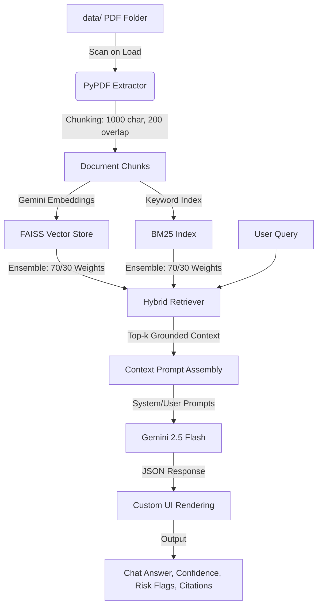

# Tech Stack & Architecture Logic: LexiGuard AI

LexiGuard AI is an advanced, enterprise-grade AI Legal, Tax, & Compliance RAG (Retrieval-Augmented Generation) assistant. The application is built to run with zero-configuration on the client side, pulling API secrets from the local environment and leveraging Google's state-of-the-art models for document embedding and content generation.

---

## 🛠️ Core Technology Stack

1. **Frontend Interface (Streamlit)**: 
   - A highly custom, premium CSS-injected UI with responsive typography (Google Fonts *Inter* & *Outfit*), brand-tailored color gradients, and clean layout blocks.
   - 4-Tab workflow system designed for multi-dimensional legal research: Chat & Q&A, Document Summarizer, Provision Compare, and Compliance Checklist.

2. **Orchestration & RAG Framework (LangChain)**:
   - Manages text splitting, vector indexing, document retriever assembly, and custom prompt formatting.

3. **Hybrid Search Retrieval (FAISS + BM25)**:
   - **FAISS (Dense Vector)**: Performs semantic search over document chunks using native Google Gemini embeddings to capture conceptual meaning.
   - **BM25 (Sparse Keyword)**: Performs traditional lexical keyword search, capturing exact matches of legal articles, numbers, and tax codes (e.g., "Section 162" or "W-9").
   - **Ensemble Retriever**: Merges search results from both retrievers with relative weights (70% FAISS, 30% BM25) to guarantee precise, grounded citations.

4. **AI Models (Google Gemini)**:
   - **LLM**: `gemini-2.5-flash` for high-speed, accurate generation, structured JSON generation, and provision comparison.
   - **Embeddings**: `models/gemini-embedding-001` (producing 3072-dimensional vector representations).

5. **Document Ingestion**:
   - **PyPDF**: Extracts structural text layouts from uploaded PDFs.
   - **Recursive Character Text Splitter**: Chunks documents into 1,000-character segments with 200-character overlaps to preserve local legal context.

---

## ⚙️ Architecture & Logic Flow

### 1. Ingestion & Indexing Pipeline
- On app startup, the directory `data/` is scanned. If new PDFs are found, they are processed in the background.
- Text is extracted, parsed into LangChain documents, and indexed.
- If the Gemini API key is missing, the indexer falls back automatically to local HuggingFace embeddings (`all-MiniLM-L6-v2`) to ensure offline availability and prevent application crashes.

### 2. Conversational Q&A & Citation Grounding
- User queries are passed through the Hybrid Retriever to fetch the top 3 relevant chunks.
- The retrieved chunks are structured into a system prompt that mandates the LLM answer based **only** on the retrieved context.
- The response is generated as a structured JSON object containing:
  - `answer`: Grounded reply with specific brackets indicating sources (e.g., `[Page 1, Section A]`).
  - `confidence`: Grounding match score (0.0 to 1.0).
  - `risk_flags`: Highlighted liabilities, strict deadlines, or legal penalties.
  - `assumptions`: Scope limits or baseline assumptions.

### 3. Tab-Specific AI Workflows
- **Summarizer**: Dynamically summaries documents clause-by-clause, breaking down legalese into plain English summary, active obligations, and critical risk flags.
- **Compare**: Pastes two legal provisions side-by-side. The model computes a semantic difference, determines the transition risk level (High/Medium/Low), and creates a checklist of compliance actions.
- **Checklist**: Parses a selected document to extract all actionable legal requirements and compiles them into an interactive checklist with priority ratings and exportable CSV formats.
